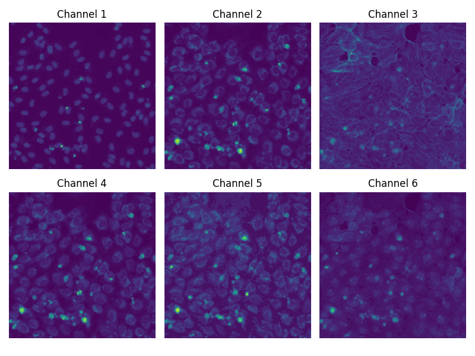

# PhI-JEPA
Image-based JEPA adapted for Multi-channel Phenomics Images.

# What are Phenomics Images?

Cell Painting assays are stained with six flourescent dyes that mark different cellular strucutres. The images are taken in 6 channels, each corresponding to a different dye and structures such as nuclei, cytoplasm, endoplasmic reticulum, golgi apparatus, mitochondria, and actin.

### Example Multi-Channel Image from the RxRx3 dataset:

 

# What is JEPA?

Join-embedding Predictive Architectures (JEPA) are a family of machine learning models designed for self-supervised pre-training 
